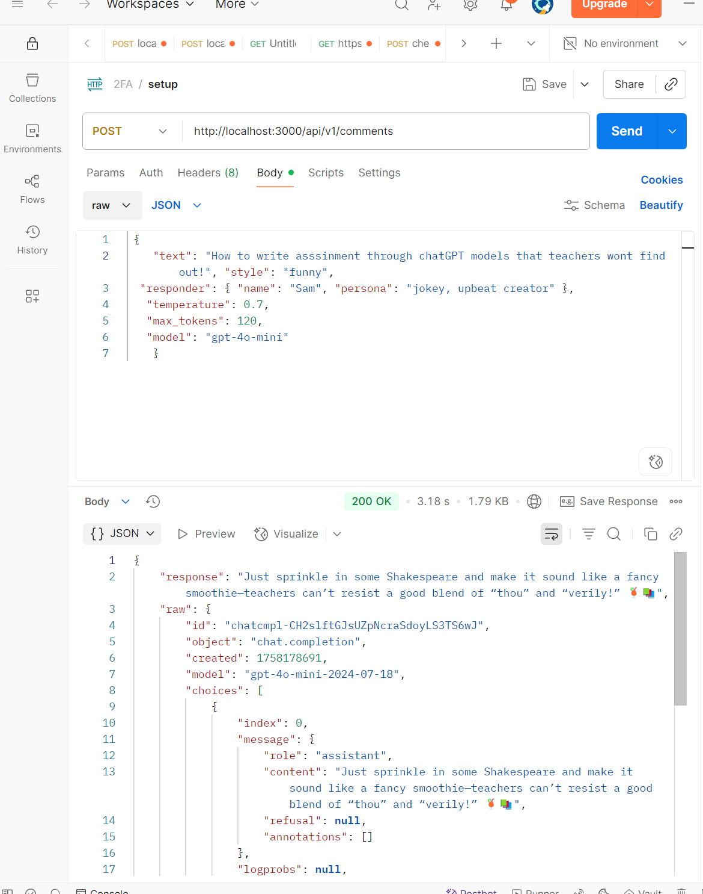

# AI Commenter & Thumbnail Generator

This repository adds two AI-powered features to the existing Express TypeScript starter:

1. Comment generator — generates short YouTube-style replies using the OpenAI Chat API.
2. Image generator — creates YouTube-style thumbnail images (or edits/variations) using the OpenAI Images API, saves them to disk, and creates a thumbnail preview.

Below I describe what I changed, how both features work, how to run and test them with Postman (or curl), and troubleshooting notes.

---

## What I changed / added

I followed the existing project pattern (controllers + routes + middlewares) and integrated the two features without changing core app startup logic.

Files created or updated:
- Added: `src/api/controllers/imageController.ts`  
  - Generates images (via OpenAI SDK if `OPENAI_API_KEY` is set; otherwise falls back to calling your `OPENAI_API_URL` endpoint using `src/lib/fetchData.ts`).
  - Supports images returned as an external URL or base64 (`b64_json`).
  - Saves images to `./uploads`, creates a thumbnail with `sharp` (optional), and returns file info.
- Added: `src/api/routes/imageRoute.ts`  
  - Defines POST `/api/v1/images` route and validation.
- Updated: `src/api/index.ts`  
  - Mounted image routes (`/images`) alongside existing comment routes (`/comments`).
- Updated: `src/api/controllers/commentController.ts`  
  - Extended the existing comment controller so the request body can include additional options (style, responder persona, temperature, max_tokens, model).
  - Uses the existing `src/lib/fetchData.ts` to call your OpenAI-compatible endpoint (so it works with internal proxies/VPNs that may not require an API key).
- Kept: `src/lib/fetchData.ts` (your wrapper for fetch that expects a full URL).

I also fixed TypeScript issues found while wiring the handlers (safe access of response properties, narrowing `res.locals` values before using them, lazy-initialization of OpenAI client so server doesn't crash when credentials are missing).

---

## Required dependencies

If not already installed, install dependencies:

- Install project deps:
  - npm install
- OpenAI SDK:
  - npm install openai
- sharp for thumbnailing:
  - npm install sharp
---

## Endpoints

1) Comment generator
- Postman: POST http://localhost:3000/api/v1/comments

2) Image generator (thumbnail)
- Postman: POST http://localhost:3000/api/v1/images

